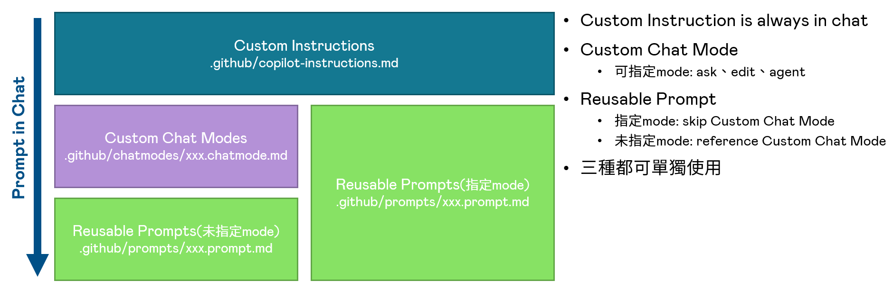

<div align="center">
# GitHub Copilot Chat Mode Zoo

[](https://github.com/features/copilot)
[](LICENSE)
[](https://github.com/github/awesome-copilot)

⭐ If you like this project, star it on GitHub — it helps a lot!

[What are Chat Modes?](#what-are-chat-modes) • [Getting Started](#getting-started) • [Chat Modes](#chat-modes) • [Instructions & Prompts](#instructions--prompts) • [Usage Examples](#usage-examples)

</div>



A curated collection of specialized GitHub Copilot chat modes, instructions, and prompts that supercharge AI-assisted development workflows. Transform GitHub Copilot into domain-specific experts for documentation, architecture design, code review, and more.

> [!TIP]
> **New to GitHub Copilot Chat Modes?** Chat modes are specialized configurations that enhance GitHub Copilot's behavior for specific tasks, providing expert-level guidance and consistent automation for development workflows.

## What are Chat Modes?

Chat modes are specialized configurations that enhance GitHub Copilot's behavior for specific development tasks. They act as expert personas with domain-specific knowledge, providing consistent, high-quality assistance for particular scenarios.

### Key Benefits

- **Expert Guidance** - Access specialized knowledge for documentation, architecture, testing, and code review
- **Consistency** - Standardized approaches across projects and team members  
- **Time Saving** - Pre-configured prompts eliminate repetitive setup
- **Quality Assurance** - Built-in best practices and industry standards
- **Customizable** - Easy to adapt for specific team needs and workflows

## Features

- **🎯 Specialized Chat Modes** - Domain-specific expert configurations for common development tasks
- **📝 Comprehensive Instructions** - Language and framework-specific coding guidelines  
- **⚡ Ready-to-Use Prompts** - Pre-built prompt templates for quick workflow automation
- **🔧 Flexible Integration** - Simple setup process that works with any GitHub Copilot-enabled environment
- **🏗️ Best Practices Built-in** - Industry standards and conventions embedded in every mode

## Chat Modes

### 📝 Documentation & Planning

- **[CreaterReadme](.github/chatmodes/CreaterReadme.chatmode.md)** - Generate comprehensive, well-structured README files with best practices
- **[EpicPRD](.github/chatmodes/EpicPRD.chatmode.md)** - Create detailed Epic Product Requirements Documents for complex features
- **[Plan](.github/chatmodes/Plan.chatmode.md)** - Generate detailed implementation plans and technical specifications

### 🏗️ Architecture & Design

- **[ProjectBlueprint](.github/chatmodes/ProjectBlueprint.chatmode.md)** - Create comprehensive project architecture documentation and technical overviews
- **[ProjectFolderStructureBlueprintGenerator](.github/chatmodes/ProjectFolderStructureBlueprintGenerator.chatmode.md)** - Document and standardize project folder structures with conventions

### 🔧 Code Quality & Standards

- **[Python](.github/chatmodes/Python.chatmode.md)** - Python coding conventions, best practices, and PEP 8 compliance
- **[ReviewAndRefactor](.github/chatmodes/ReviewAndRefactor.chatmode.md)** - Comprehensive code review and refactoring guidance with quality improvements

## Instructions & Prompts

### 📋 Instructions

Language and framework-specific coding guidelines that apply automatically:

- **[Python Instructions](.github/instructions/python.instructions.md)** - Python coding conventions and PEP 8 guidelines
- **[C# Instructions](.github/instructions/csharp.instructions.md)** - C# coding standards and .NET best practices  
- **[Vue.js 3 Instructions](.github/instructions/vuejs3.instructions.md)** - Vue.js 3 development patterns and conventions
- **[Docker Best Practices](.github/instructions/containerization-docker-best-practices.instructions.md)** - Comprehensive containerization and Docker optimization guidelines

### 🎯 Prompt Templates

Ready-to-use prompt templates for common development tasks:

- **[Create README](.github/prompts/create-readme.prompt.md)** - Template for generating comprehensive README files
- **[Create Specification](.github/prompts/create-specification.prompt.md)** - Template for technical specifications and requirements
- **[Project Workflow Analysis](.github/prompts/project-workflow-analysis-blueprint-generator.prompt.md)** - Analyze and document project workflows
- **[Prompt Builder](.github/prompts/prompt-builder.prompt.md)** - Meta-prompt for creating custom prompts
- **[README Blueprint Generator](.github/prompts/readme-blueprint-generator.prompt.md)** - Advanced README generation with project analysis

## Getting Started

### Prerequisites

- **GitHub Copilot subscription** - Required to use chat modes and instructions
- **VS Code or compatible editor** - With GitHub Copilot extension installed
- **Git** - For cloning and managing the repository

### Quick Start

There are multiple ways to get started with this collection:

<details open>
<summary><h4>📁 Copy to Your Project</h4></summary>

1. **Clone the repository**
   ```bash
   git clone https://github.com/yourusername/github-copilot-chatmode-zoo.git
   cd github-copilot-chatmode-zoo
   ```

2. **Copy what you need**
   ```bash
   # Copy specific chat modes
   cp .github/chatmodes/CreaterReadme.chatmode.md your-project/.github/chatmodes/
   
   # Copy all chat modes
   cp -r .github/chatmodes your-project/.github/
   
   # Copy instructions for automatic application
   cp -r .github/instructions your-project/.github/
   ```

3. **Start using in GitHub Copilot Chat**
   - Chat modes are automatically detected from `.github/chatmodes/`
   - Instructions apply automatically based on file patterns
   - Reference modes using `#CreaterReadme` syntax

</details>

<details>
<summary><h4>🔗 Use as Submodule</h4></summary>

Add this repository as a git submodule to keep it updated:

```bash
# Add as submodule
git submodule add https://github.com/yourusername/github-copilot-chatmode-zoo .github/copilot-zoo

# Create symlinks to use the modes
ln -sf copilot-zoo/chatmodes .github/chatmodes
ln -sf copilot-zoo/instructions .github/instructions
```

</details>

<details>
<summary><h4>⚡ Quick Usage (No Installation)</h4></summary>

You can reference chat modes directly from this repository:

```text
@github-copilot-chatmode-zoo Please use the CreaterReadme chat mode to create a README for my TypeScript project
```

</details>

## Usage Examples

### Chat Mode Examples

**Generate a comprehensive README:**
```text
#CreaterReadme Please create a detailed README for my TypeScript API project with Express.js
```

**Create an Epic PRD:**
```text
#EpicPRD Help me create a PRD for implementing user authentication with OAuth2 and multi-factor authentication
```

**Review and improve code:**
```text
#ReviewAndRefactor Review this Python module and suggest improvements following PEP 8 and best practices
```

**Generate project architecture documentation:**
```text
#ProjectBlueprint Analyze my Next.js project structure and create comprehensive architecture documentation
```

### Instruction Usage

Instructions apply automatically based on file patterns. For example:

- Python files (`**/*.py`) automatically use Python coding conventions
- Docker files automatically apply containerization best practices
- Vue.js files follow Vue 3 composition API patterns

### Prompt Template Usage

Reference prompt templates for consistent workflows:

```text
Use the create-specification prompt template to generate technical requirements for my REST API
```

### Advanced Workflows

**Multi-mode documentation workflow:**
```text
#ProjectBlueprint First analyze my project structure, then #CreaterReadme create a comprehensive README based on the architecture analysis
```

**Code quality pipeline:**
```text
#ReviewAndRefactor Review this module, then #Plan create an implementation plan for the suggested improvements
```

## How It Works

### Chat Mode Structure

Each chat mode follows a consistent YAML frontmatter format:

```yaml
---
mode: 'agent'                    # Chat mode type
description: 'Brief description' # What this mode does
---

# Mode Instructions
Detailed instructions for the AI assistant...
```

### Instruction Structure

Instructions automatically apply to files matching specific patterns:

```yaml
---
description: 'Python coding conventions'
applyTo: '**/*.py'              # File patterns to apply to
---

# Python Coding Guidelines
Detailed coding standards and best practices...
```

## Use Cases

### For Individual Developers

- **Documentation** - Generate high-quality README files, API docs, and project overviews
- **Code Quality** - Follow coding best practices consistently across languages
- **Planning** - Create structured implementation plans and technical specifications
- **Architecture** - Document and analyze project structure and design patterns

### For Development Teams

- **Standardization** - Ensure consistent documentation and code review processes
- **Onboarding** - Accelerate new developer onboarding with clear project blueprints
- **Quality Gates** - Maintain architectural consistency and coding standards
- **Workflow Automation** - Streamline common development tasks and documentation

### For Technical Leaders

- **Requirements** - Create detailed PRDs and technical specifications
- **Architecture Reviews** - Document and evaluate system design decisions  
- **Standards** - Establish and maintain team coding conventions
- **Planning** - Structure complex feature development with comprehensive plans

## Advanced Configuration

> [!TIP]
> **Custom Chat Modes**: Create your own chat modes by following the structure in existing `.chatmode.md` files. Place them in `.github/chatmodes/` for automatic detection.

> [!NOTE]  
> **Multi-language Support**: Instructions can be combined for polyglot projects. Use different `applyTo` patterns to target specific languages and frameworks.

### Creating Custom Modes

1. **Create a new `.chatmode.md` file** in `.github/chatmodes/`
2. **Add YAML frontmatter** with mode type and description
3. **Write detailed instructions** for the AI assistant
4. **Test and iterate** on the mode behavior

### Team Configuration

For teams, consider:

- Customizing existing modes for your specific tech stack
- Adding organization-specific coding standards
- Creating modes for your deployment and testing workflows
- Establishing consistent documentation patterns

## Roadmap

- [ ] Additional language-specific chat modes (JavaScript, Java, C#, Rust)
- [ ] Testing and QA focused modes (unit tests, integration tests, E2E)
- [ ] DevOps and deployment modes (CI/CD, infrastructure as code)
- [ ] API design and documentation modes (OpenAPI, GraphQL)
- [ ] Security review and audit modes (SAST, dependency scanning)
- [ ] Performance optimization modes (profiling, monitoring)
- [ ] Mobile development modes (React Native, Flutter)
- [ ] Data engineering modes (ETL, data pipelines)
